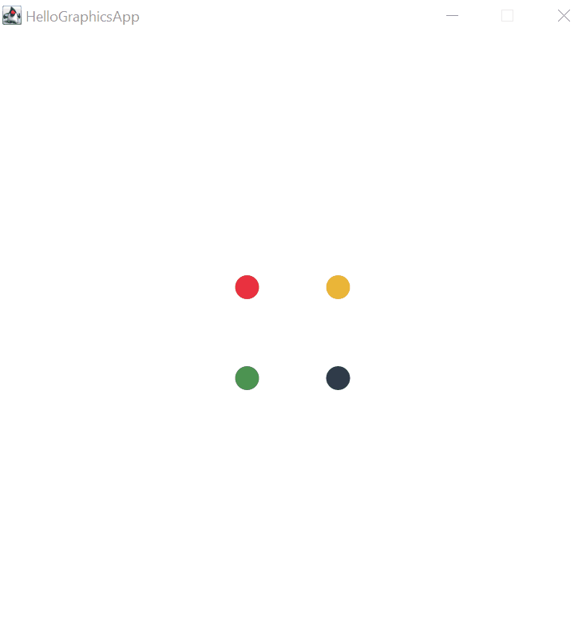

# Hello GraphicsApp

In dieser ersten Graphics App-Anwendung werden vier verschieden farbige Kreise animiert. Die Kreise befinden sich  initial in etwas am Mittelpunkt der Zeichenfläche und werden im Rahmen des Draw Loops schrittweisen in Richtung jeweils  einer der Ecken des Fensters bewegt. Die Kreise verlassen dabei die sichtbare Fläche der Anwendung.

## Relevante Bezüge zum OOP-Kurs

Diese Demo kann als erstes, komplexeres Beispiel im Rahmen der Einführung der _GraphicsApp_-Umgebung verwendet werden, um die Möglichkeiten zur Umsetzung einfacher Animationen zu erläutern. 

- Nutzung von **Konstanten** zur Abbildung unveränderlicher Konfigurationswerte, z.B. der Bewegungsgeschwindigkeit der Kreise
- Private **Instanzvariablen** in der _GraphicsApp_-Klasse für die Verwaltung der animierten Objekte
- Methoden mit **Parametern** und **Rückgaben** zur Erzeugung und Bewegen der Kreise (auch **Dekomposition**)
- Nutzung zentraler Klassen aus der **GraphicsApp**-API, z.B. `Color` und `Circle`
- Dauerhafte Animation durch Verwendung des **Draw Loop** über die `draw`-Methode